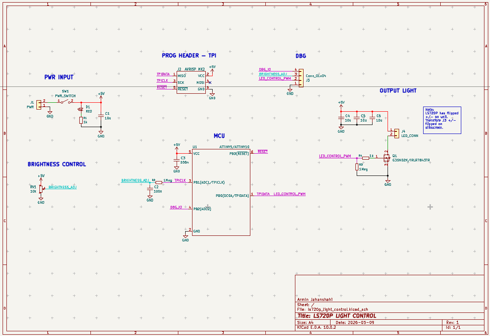
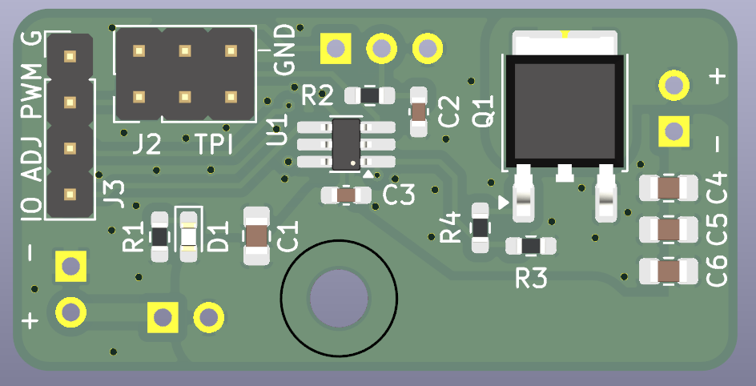
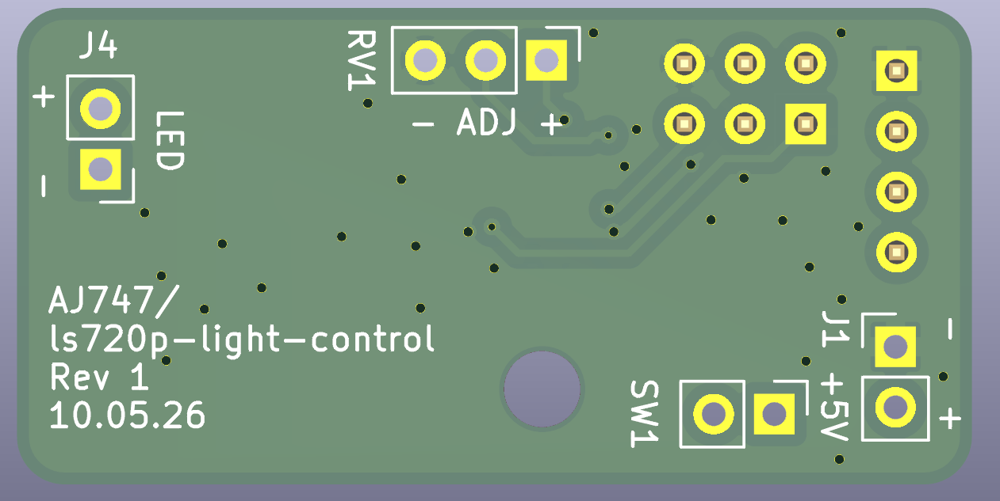

# LS720P Light Control PCB
Controller for LS720P light using ATTINY5. Brightness is controlled using potentiometer. +12V input and switch for power on/off. Made in KiCad 10.

# Schematic

# Images of PCB

Top layer

Bottom layer
